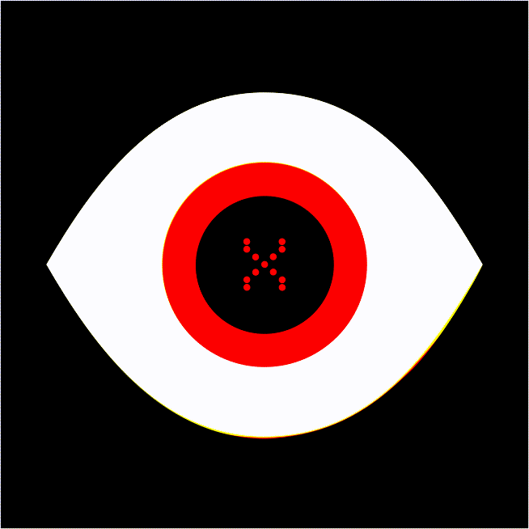

# cenxur
A Discord bot that flags inappropriate messages but personalised to your server.

Here's how Cenxur works:
1. Cenxur flags an inappropriate message
2. Your users or moderators vote on whether that message was *actually* inappropriate
3. Cenxur learns from this
4. Cenxur adapts to the messages you find inappropriate

## Usage

1. `git clone git@github.com:FrankWhoee/cenxur.git`
2. `cd cenxur`
3. `pip install -r requirements.txt`
4. `python3 main.py`
5. Fill in .env with your Discord bot token
6. Run it again: `python3 main.py`

## How does it work?

At its core, Cenxur uses [Naive Bayes](https://en.wikipedia.org/wiki/Naive_Bayes_classifier) to classify messages. Currently Cenxur does not use [Laplace smoothing](https://en.wikipedia.org/wiki/Additive_smoothing), but this will be added in future versions.

Cenxur will flag 10% of messages randomly just for data gathering, and this is denoted by a magnifying glass react: 🔎. If users vote on whether this message is appropriate or inappropriate, this result will be saved into a SQLite database which is then later called upon to retrain the entire model. This model was entirely manually implemented using numpy, the code for which can be found in [model.py](./model.py). Once the model is retrained, the weights are updated and the new model is instantly redeployed without any supervision, making Cenxur's improvement continuous.
